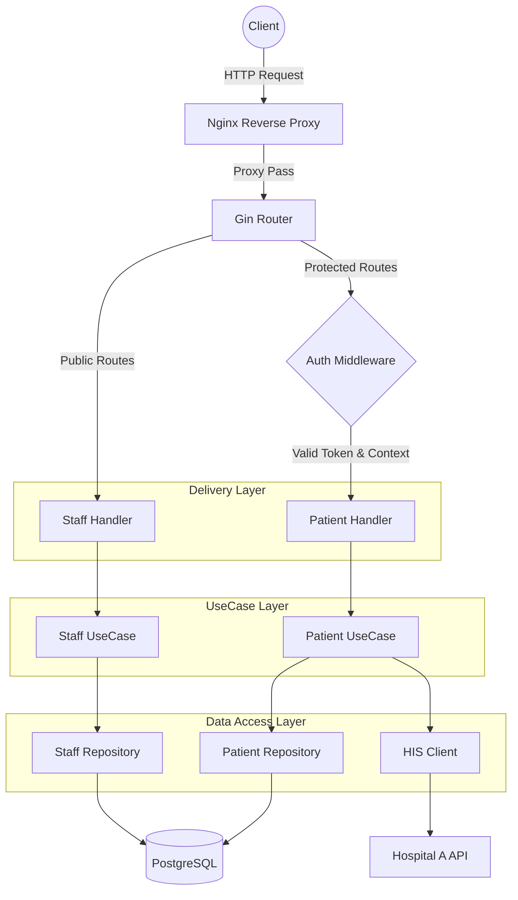
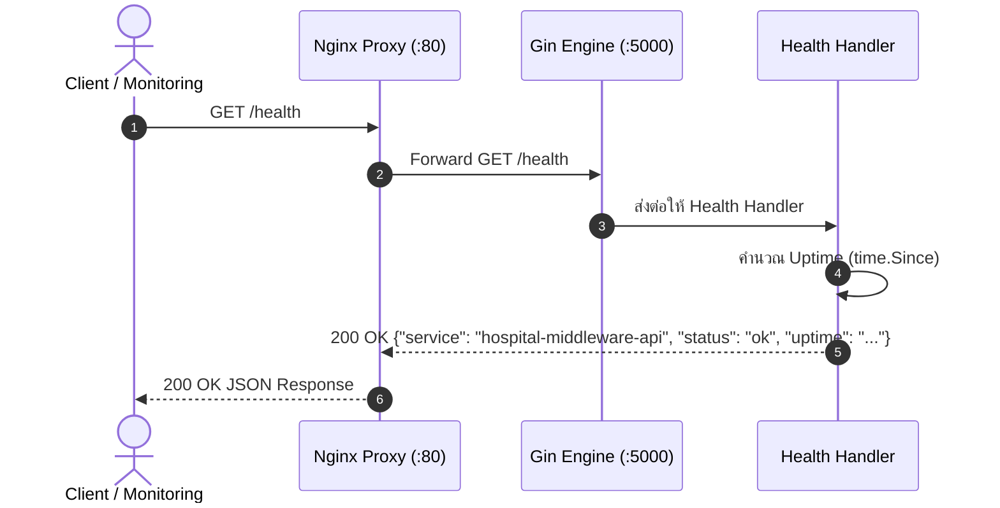
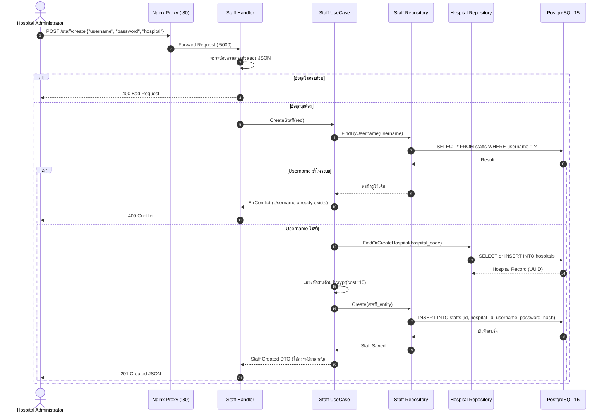
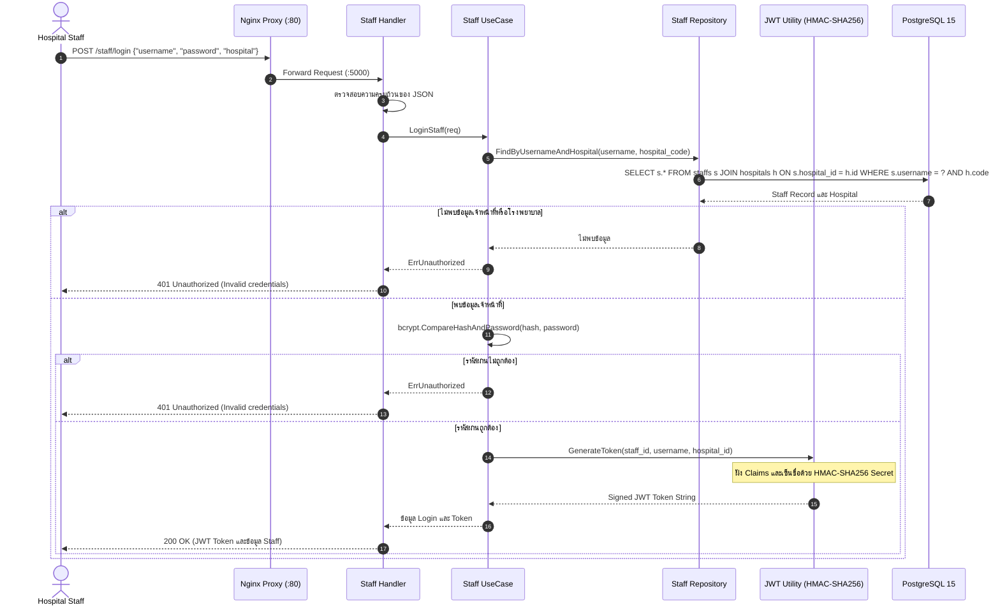
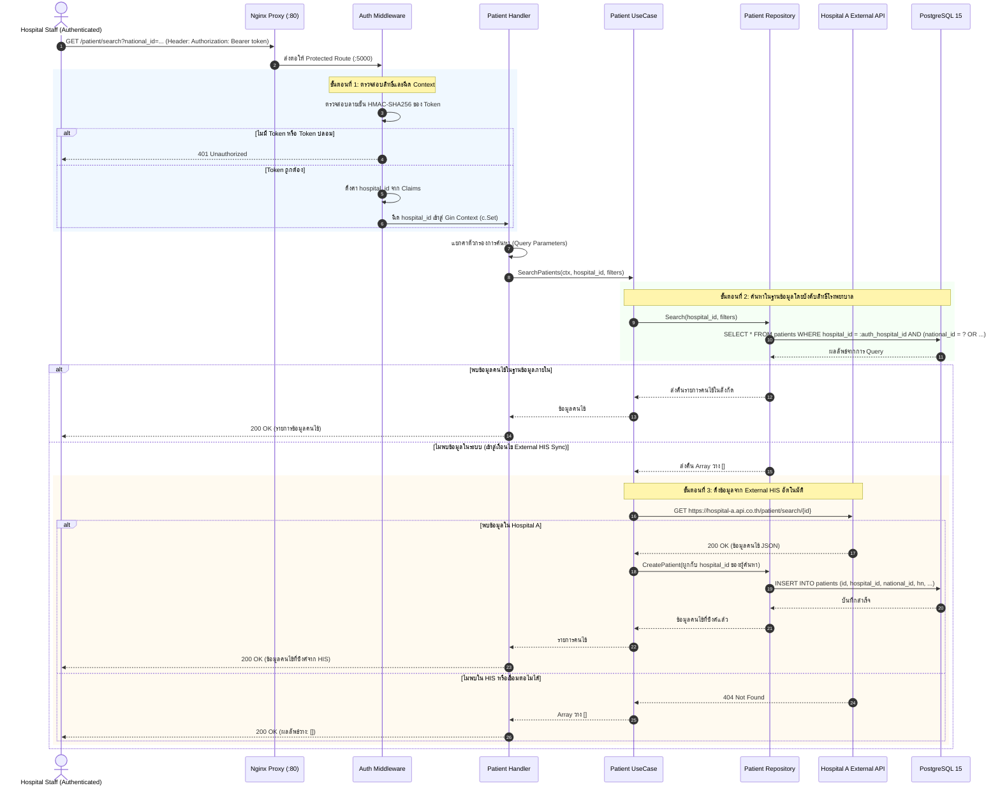
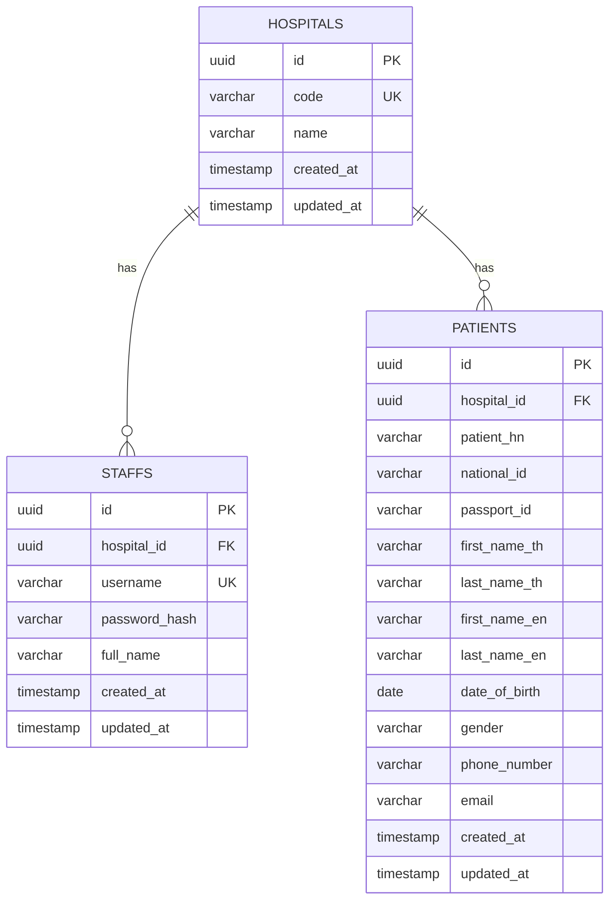

# Hospital Middleware API: Architecture and Database Schema

เอกสารฉบับนี้อธิบายถึงสถาปัตยกรรมซอฟต์แวร์และการออกแบบฐานข้อมูลสำหรับโปรเจกต์ `hospital-middleware-api` โดยเน้นที่ Clean Architecture, Database Schema, และ Data Isolation ตามข้อกำหนดของ Agnos Health.

## 1. Clean Architecture (Go + Gin)

ระบบได้รับการออกแบบโดยใช้หลักการ Clean Architecture (Layered Architecture) เพื่อแบ่งแยกความรับผิดชอบ (Separation of Concerns) ทำให้โค้ดอ่านง่าย ทดสอบง่าย และบำรุงรักษาได้สะดวก.

### 1.1 Architecture Flow

Flow การทำงานของระบบตั้งแต่ Client ร้องขอข้อมูลจนถึงการตอบกลับ มีดังนี้:

1. **Client / Nginx:** Request ถูกส่งเข้ามายัง Nginx Reverse Proxy ซึ่งทำหน้าที่จัดการ Route, Load Balance, และ Security เบื้องต้น ก่อนส่งต่อไปยัง Go (Gin) API.
2. **Gin Router:** Gin Framework รับ Request และกระจายไปยัง Route ที่กำหนดไว้.
3. **Auth Middleware:** สำหรับ API ที่ต้องการการยืนยันตัวตน (เช่น `/patient/search`) Request จะต้องผ่าน Auth Middleware เพื่อตรวจสอบความถูกต้องของ JWT Token และดึง `hospital_id` ลงใน Gin Context.
4. **Handler (Delivery Layer):** รับข้อมูลจาก Request (เช่น JSON Body, Query Parameters), แปลงข้อมูล, และเรียกใช้งาน UseCase ที่เหมาะสม.
5. **UseCase (Business Logic Layer):** ดำเนินการตาม Business Logic เช่น ตรวจสอบเงื่อนไข, ติดต่อ Repository เพื่อดึงข้อมูล, หรือเรียกใช้งาน External HIS Client.
6. **Repository / HIS Client (Data Layer):**
   - **Repository:** ทำการ Query ข้อมูลจาก PostgreSQL Database โดยต้องบังคับเงื่อนไข Data Isolation.
   - **HIS Client:** ทำการส่ง HTTP Request ไปยัง External API (Hospital A API) เพื่อดึงข้อมูลเพิ่มเติม.
7. **PostgreSQL / Hospital A API:** แหล่งเก็บข้อมูลและระบบภายนอกส่งข้อมูลกลับมาตามลำดับชั้นจนถึง Client.

### 1.2 สถาปัตยกรรมและการไหลของข้อมูล (Architecture Flow Diagram)



### 1.3 Sequence Diagrams ตามแต่ละ Endpoint

#### 1.3.1 ตรวจสอบสถานะระบบ (`GET /health`)


#### 1.3.2 สร้างบัญชีเจ้าหน้าที่ (`POST /staff/create`)


#### 1.3.3 เจ้าหน้าที่เข้าสู่ระบบ (`POST /staff/login`)


#### 1.3.4 ค้นหาข้อมูลคนไข้และการแยกข้อมูล (`GET /patient/search`)


### 1.4 Project Directory Structure

โครงสร้างโฟลเดอร์ถูกจัดระเบียบตามแนวทางของ Clean Architecture:

```text
hospital-middleware-api/
├── api/
│   └── docs/                       # โค้ดและไฟล์ Specification ของ Swagger (docs.go, swagger.json, swagger.yaml)
├── cmd/
│   └── server/
│       └── main.go                 # จุดเริ่มต้นของแอปพลิเคชัน (Entry point)
├── config/
│   └── config.go                   # การโหลด Environment Variables
├── docs/                           # เอกสารสถาปัตยกรรม, แผนพัฒนา, และรายงานผลการทดสอบ (Markdown)
├── internal/
│   ├── domain/                     # Domain Entities (structs) และ Interfaces
│   ├── repository/                 # Data Access Layer (ติดต่อ PostgreSQL)
│   ├── usecase/                    # Business Logic Layer
│   ├── delivery/
│   │   └── http/                   # HTTP Transport Layer (Gin Handlers & Middleware)
│   └── client/                     # External Integration (HIS Client เชื่อมต่อ Hospital A)
├── pkg/
│   ├── utils/                      # Helper Functions (Password hashing, JWT generation)
│   └── response/                   # Standardized JSON Response Structs
├── migrations/                     # SQL DDL Scripts สำหรับสร้างตาราง
├── nginx/                          # Nginx Configuration
├── Dockerfile                      # คำสั่งสร้าง Docker Image สำหรับ Go API
└── docker-compose.yml              # ไฟล์กำหนด Services สำหรับรันโปรเจกต์ (Go, Postgres, Nginx)
```

## 2. Database Schema (PostgreSQL)

การออกแบบตารางในฐานข้อมูล PostgreSQL คำนึงถึงความถูกต้องของข้อมูล (Data Integrity), ความสัมพันธ์ (Relationships), และประสิทธิภาพการสืบค้น (Performance & Indexing).

### 2.1 Entity Relationship Diagram (ER Diagram)



### 2.2 กฎทางธุรกิจและความสัมพันธ์ระหว่างข้อมูล (Business Rules & Relationship Narrative)

โครงสร้างฐานข้อมูลบังคับใช้กฎทางธุรกิจ (Business Rules) ที่สำคัญดังนี้:

#### 1. ขอบเขตโรงพยาบาลและการแยกข้อมูล (Hospital Multi-Tenancy Boundary)
* **BR-HOSP-01 (ขอบเขตองค์กรอิสระ):** แต่ละแถวในตาราง `hospitals` คือตัวแทนขององค์กรโรงพยาบาลและเป็นขอบเขต Tenant แยกขาดจากกันโดยสิ้นเชิง
* **BR-HOSP-02 (การระบุตัวตนที่ไม่ซ้ำ):** โรงพยาบาลทุกแห่งต้องมี UUID Primary Key (`id`) และรหัสย่อประจำโรงพยาบาล (`code UK`) ที่ไม่ซ้ำกัน เช่น `"hospital-a"`
* **BR-HOSP-03 (ความถูกต้องของข้อมูลอ้างอิง):** ห้ามลบข้อมูลโรงพยาบาลหากยังมีประวัติเจ้าหน้าที่หรือคนไข้ผูกอยู่ (`ON DELETE RESTRICT`)

#### 2. การจัดการเจ้าหน้าที่และการควบคุมสิทธิ์ (Staff Management & Access Control)
* **BR-STAFF-01 (การสังกัดโรงพยาบาล):** เจ้าหน้าที่ทุกคนต้องสังกัดโรงพยาบาลเพียงแห่งเดียวเท่านั้น (`hospital_id NOT NULL REFERENCES hospitals(id)`) ห้ามมีบัญชีเจ้าหน้าที่ลอยที่ไม่มีสังกัด
* **BR-STAFF-02 (ชื่อบัญชีต้องไม่ซ้ำ):** เจ้าหน้าที่แต่ละคนต้องมี `username (UK)` ที่ไม่ซ้ำกันในทั้งระบบ หากมีการสมัครซ้ำระบบจะปฏิเสธด้วย HTTP 409 Conflict
* **BR-STAFF-03 (ความปลอดภัยของรหัสผ่าน):** รหัสผ่านต้องถูกเข้ารหัสด้วย bcrypt ก่อนบันทึกลงฐานข้อมูลเสมอ ห้ามจัดเก็บ Plaintext โดยเด็ดขาด
* **BR-STAFF-04 (ความสัมพันธ์กับโรงพยาบาล):** โรงพยาบาล 1 แห่ง มีเจ้าหน้าที่ได้ตั้งแต่ 0 ถึงหลายคน (`HOSPITALS ||--o{ STAFFS`) ขณะที่เจ้าหน้าที่ 1 คน สังกัดได้เพียง 1 โรงพยาบาลเท่านั้น

#### 3. ระเบียนคนไข้และการแยกสิทธิ์ข้อมูล (Patient Records & Data Isolation)
* **BR-PAT-01 (กรรมสิทธิ์ข้อมูลระดับโรงพยาบาล):** ข้อมูลคนไข้แต่ละรายการต้องเป็นกรรมสิทธิ์ของโรงพยาบาลเพียงแห่งเดียว (`hospital_id NOT NULL REFERENCES hospitals(id)`)
* **BR-PAT-02 (การแยกสิทธิ์ข้อมูลอย่างเด็ดขาด):** เจ้าหน้าที่จะสามารถค้นหาและดูข้อมูลได้เฉพาะคนไข้ที่สังกัดโรงพยาบาลเดียวกันกับตนเองเท่านั้น (`WHERE hospital_id = :authenticated_hospital_id`)
* **BR-PAT-03 (การระบุตัวตนคนไข้ตามสังกัด):** คนไข้แต่ละคนจะถูกระบุด้วย `patient_hn`, `national_id` (เลขบัตรประชาชน), หรือ `passport_id` (เลขพาสปอร์ต) หากบุคคลเดียวกันไปรับการรักษาที่ 2 โรงพยาบาล จะถูกจัดเก็บเป็น 2 ระเบียนแยกขาดจากกัน
* **BR-PAT-04 (การซิงค์ข้อมูลจาก External HIS):** เมื่อค้นหาคนไข้ในฐานข้อมูลท้องถิ่นไม่พบ ระบบจะส่งคำขอไปยัง External HIS (Hospital A API) หากพบข้อมูล จะทำการซิงค์และบันทึกลงฐานข้อมูลโดยผูกกับ `hospital_id` ของโรงพยาบาลผู้ค้นหาทันที
* **BR-PAT-05 (ความสัมพันธ์กับโรงพยาบาล):** โรงพยาบาล 1 แห่ง มีระเบียนคนไข้ได้ตั้งแต่ 0 ถึงหลายคน (`HOSPITALS ||--o{ PATIENTS`) ขณะที่ระเบียนคนไข้แต่ละรายการ ผูกอยู่กับ 1 โรงพยาบาลเท่านั้น

### 2.3 โครงสร้างตารางและดัชนี (Tables and Indexes)

เพื่อรองรับการค้นหา `GET /patient/search` ที่ทุกพารามิเตอร์เป็น Optional เราจำเป็นต้องสร้าง Index สำหรับคอลัมน์ที่คาดว่าจะถูกใช้ค้นหาบ่อย.

- **hospitals:** เก็บข้อมูลโรงพยาบาล.
- **staffs:** เก็บข้อมูลเจ้าหน้าที่ เชื่อมกับ hospitals.
- **patients:** เก็บข้อมูลคนไข้ เชื่อมกับ hospitals.

**Composite Indexes และ Partial Indexes:**
เนื่องจากการค้นหามักจะระบุ `hospital_id` เป็นหลักตามด้วยฟิลด์อื่นๆ เราจึงสร้าง Index ที่นำหน้าด้วย `hospital_id` เช่น `(hospital_id, national_id)` หรือ `(hospital_id, phone_number)` เพื่อให้ PostgreSQL สามารถกรองข้อมูลระดับโรงพยาบาลได้เร็วที่สุด.

### 2.3 SQL DDL (Schema Script)

```sql
-- เปิดการใช้งาน UUID Extension หากยังไม่ได้เปิด
CREATE EXTENSION IF NOT EXISTS "uuid-ossp";

-- Table: hospitals
CREATE TABLE hospitals (
    id UUID PRIMARY KEY DEFAULT uuid_generate_v4(),
    code VARCHAR(50) NOT NULL UNIQUE,
    name VARCHAR(255) NOT NULL,
    created_at TIMESTAMP WITH TIME ZONE DEFAULT CURRENT_TIMESTAMP,
    updated_at TIMESTAMP WITH TIME ZONE DEFAULT CURRENT_TIMESTAMP
);

-- Table: staffs
CREATE TABLE staffs (
    id UUID PRIMARY KEY DEFAULT uuid_generate_v4(),
    hospital_id UUID NOT NULL REFERENCES hospitals(id) ON DELETE CASCADE,
    username VARCHAR(100) NOT NULL UNIQUE,
    password_hash VARCHAR(255) NOT NULL,
    full_name VARCHAR(255),
    created_at TIMESTAMP WITH TIME ZONE DEFAULT CURRENT_TIMESTAMP,
    updated_at TIMESTAMP WITH TIME ZONE DEFAULT CURRENT_TIMESTAMP
);

-- Table: patients
CREATE TABLE patients (
    id UUID PRIMARY KEY DEFAULT uuid_generate_v4(),
    hospital_id UUID NOT NULL REFERENCES hospitals(id) ON DELETE CASCADE,
    patient_hn VARCHAR(100),
    national_id VARCHAR(20),
    passport_id VARCHAR(50),
    first_name_th VARCHAR(100),
    middle_name_th VARCHAR(100),
    last_name_th VARCHAR(100),
    first_name_en VARCHAR(100),
    middle_name_en VARCHAR(100),
    last_name_en VARCHAR(100),
    date_of_birth DATE,
    gender VARCHAR(1) CHECK (gender IN ('M', 'F')),
    phone_number VARCHAR(50),
    email VARCHAR(255),
    created_at TIMESTAMP WITH TIME ZONE DEFAULT CURRENT_TIMESTAMP,
    updated_at TIMESTAMP WITH TIME ZONE DEFAULT CURRENT_TIMESTAMP
);

-- Indexes for APIs Performance Optimization
-- การค้นหามักจะระบุ hospital_id เสมอ ดังนั้นจึงขึ้นต้นด้วย hospital_id
CREATE INDEX idx_patients_hospital_national_id ON patients(hospital_id, national_id);
CREATE INDEX idx_patients_hospital_passport_id ON patients(hospital_id, passport_id);
CREATE INDEX idx_patients_hospital_phone ON patients(hospital_id, phone_number);
CREATE INDEX idx_patients_hospital_email ON patients(hospital_id, email);
CREATE INDEX idx_patients_hospital_name_th ON patients(hospital_id, first_name_th, last_name_th);
```

## 3. Data Isolation (Multi-tenancy by Hospital)

กลไก Data Isolation เป็นหัวใจสำคัญด้านความปลอดภัย เพื่อรับประกันว่า เจ้าหน้าที่ของ Hospital A จะไม่มีทางเข้าถึงหรือค้นหาข้อมูลคนไข้ของ Hospital B ได้.

กระบวนการรักษาความปลอดภัยถูกกำหนดไว้ 3 ระดับ ดังนี้:

### 3.1 ระดับ JWT Claims (Authentication)
เมื่อเจ้าหน้าที่เข้าสู่ระบบ (`/staff/login`) สำเร็จ ระบบจะสร้าง JWT Token ที่มี Payload ระบุข้อมูลประจำตัวและสังกัดโรงพยาบาลของเจ้าหน้าที่ผู้นั้น ตัวอย่าง Payload:
```json
{
  "staff_id": "uuid-of-staff",
  "username": "staff_a_user",
  "hospital_id": "uuid-of-hospital-a",
  "exp": 1700000000
}
```
Token นี้จะถูกเข้ารหัส (Signed) ทำให้ไม่สามารถปลอมแปลงค่า `hospital_id` ได้.

### 3.2 ระดับ Gin Context (Middleware)
ทุก Request ที่เรียกไปยัง `/patient/search` จะต้องผ่าน `AuthMiddleware`.
Middleware จะทำหน้าที่:
1. แกะ JWT Token และตรวจสอบความถูกต้อง.
2. ดึงค่า `hospital_id` จาก Payload.
3. บันทึกค่าลงใน Context ของ Gin: `c.Set("hospital_id", claims.HospitalID)`.
วิธีการนี้ทำให้แน่ใจได้ว่า Route Handler และ UseCase จะได้รับรหัสโรงพยาบาลที่แท้จริงของเจ้าหน้าที่ผู้นั้น โดยไม่ต้องพึ่งพาข้อมูลจาก Client Request.

### 3.3 ระดับ Repository Query (Data Access)
เมื่อ UseCase สั่งให้ Patient Repository ค้นหาข้อมูล Repository จะต้องดึงค่า `hospital_id` ที่มาจาก Context เสมอ และบังคับใส่เป็นเงื่อนไขแรกสุดในคำสั่ง SQL (WHERE Clause):
```sql
SELECT * FROM patients 
WHERE hospital_id = $1 
  AND (national_id = $2 OR $2 IS NULL)
  AND (first_name_th = $3 OR $3 IS NULL);
```
โดยที่ `$1` ถูกส่งค่ามาจาก `c.Get("hospital_id")`.
การบังคับ `WHERE hospital_id = :authenticated_hospital_id` ในระดับ Database Query ทำให้ไม่ว่าเงื่อนไขการค้นหาอื่นจะเป็นอย่างไร ผลลัพธ์ที่ได้จะถูกจำกัดขอบเขตอยู่แค่ภายในโรงพยาบาลของเจ้าหน้าที่เท่านั้นอย่างเด็ดขาด.
