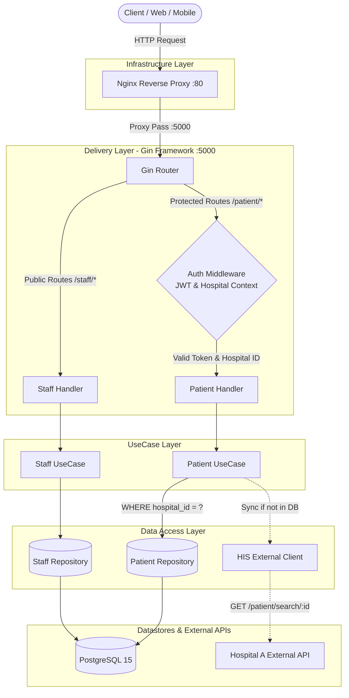
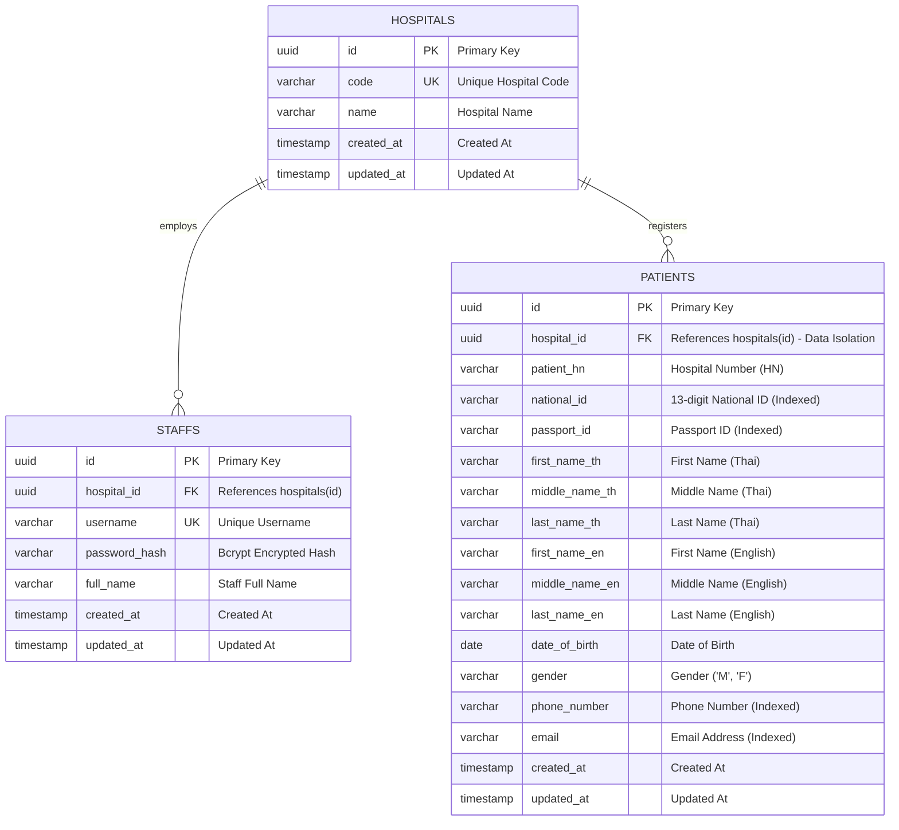

# Hospital Middleware API: Development Planning Documentation

> **Candidate:** Cherdsak Kh.  
> **Position:** Back-end Developer  
> **Company:** Agnos Health Co., Ltd.  
> **Repository:** [https://github.com/cherdsak-kh/hospital-middleware-api](https://github.com/cherdsak-kh/hospital-middleware-api)  
> **Interactive Documentation:** `http://localhost:5000/swagger/index.html`

---

## 1. Project Overview & Architecture

The **Hospital Middleware API** (`hospital-middleware-api`) is an enterprise-grade backend service built with **Go (Golang 1.27)** and the **Gin Web Framework**. It serves as an intermediary gateway connecting to Hospital Information Systems (HIS) and providing secure patient search capabilities while enforcing strict hospital-level data isolation.

### 1.1 Architectural Pattern: Clean Architecture (Layered Architecture)

The system adheres to the principles of Clean Architecture to ensure separation of concerns, high maintainability, and testability. The application is structured into four distinct layers:

1. **Delivery Layer (`internal/delivery/http`):**
   * Manages incoming HTTP requests via the Gin Framework.
   * Handles request validation, parameter binding, and standardized JSON responses.
   * Enforces security policies through middleware (CORS, JWT Authentication, Hospital Context Injection).
2. **UseCase Layer (`internal/usecase`):**
   * Houses core business logic independent of external frameworks.
   * Orchestrates staff registration, credential verification, and patient search operations.
   * Interacts with external HIS services for patient data synchronization.
3. **Domain Layer (`internal/domain`):**
   * Defines core business entities, data transfer objects (DTOs), and interface contracts.
   * Serves as the central contract across all layers.
4. **Data Access Layer (`internal/repository` & `internal/client`):**
   * `internal/repository`: Interacts with PostgreSQL using GORM, enforcing strict SQL WHERE filters for data isolation.
   * `internal/client`: External HTTP client connecting to Hospital A API (`GET https://hospital-a.api.co.th/patient/search/{id}`).

### 1.2 Request Flow Diagram



---

## 2. Project Structure (Deliverable 1a)

```text
hospital-middleware-api/
├── cmd/
│   └── server/
│       └── main.go                  # Application entrypoint & dependency injection
├── config/
│   └── config.go                    # Environment variable loader (.env & system environment)
├── internal/
│   ├── domain/                      # Domain entities, DTOs, and interface contracts
│   │   ├── hospital.go              # Hospital entity & interfaces
│   │   ├── staff.go                 # Staff entity, request/response DTOs
│   │   └── patient.go               # Patient entity, search query DTOs, external HIS DTOs
│   ├── repository/                  # Database access layer (PostgreSQL / GORM)
│   │   ├── db.go                    # Database initialization & automated migration
│   │   ├── hospital_repository.go   # Hospital data access
│   │   ├── staff_repository.go      # Staff data access & credential verification
│   │   └── patient_repository.go    # Dynamic search with strict hospital_id enforcement
│   ├── usecase/                     # Business logic layer
│   │   ├── staff_usecase.go         # Password hashing (bcrypt) & JWT token issuance
│   │   ├── staff_usecase_test.go    # Unit tests for staff operations
│   │   ├── patient_usecase.go       # Multi-field search & external HIS sync
│   │   └── patient_usecase_test.go  # Unit tests for data isolation & HIS sync
│   ├── delivery/
│   │   └── http/                    # HTTP transport layer (Gin Framework)
│   │       ├── middleware/
│   │       │   ├── auth_middleware.go      # Bearer JWT verification & context injection
│   │       │   └── auth_middleware_test.go # Unit tests for auth middleware
│   │       ├── staff_handler.go            # Handlers for /staff/create and /staff/login
│   │       ├── patient_handler.go          # Handlers for /patient/search (GET/POST)
│   │       └── router.go                   # Route registration, CORS, health, swagger routes
│   └── client/
│       └── his_client.go            # HTTP client for Hospital A external API
├── pkg/
│   ├── utils/                       # Shared utility functions
│   │   ├── password.go              # bcrypt password hashing & validation
│   │   ├── password_test.go         # Unit tests for password utility
│   │   ├── jwt.go                   # JWT token generation & claim extraction
│   │   └── jwt_test.go              # Unit tests for JWT utility
│   └── response/
│       └── response.go              # Standardized JSON response envelope
├── docs/                            # Documentation assets
│   ├── architecture_and_schema.md   # Architecture design and ER model
│   ├── docs.go                      # Swagger generated Go file
│   ├── swagger.json                 # OpenAPI 2.0 specification
│   └── swagger.yaml                 # OpenAPI 2.0 YAML specification
├── migrations/
│   └── 000001_init_schema.up.sql    # DDL script with composite index definitions
├── nginx/                           # Reverse proxy configuration
│   ├── nginx.conf                   # Global Nginx settings
│   └── conf.d/default.conf          # Server block & proxy forwarding rules
├── Dockerfile                       # Multi-stage build for minimal Alpine container
├── docker-compose.yml               # Service definitions: db, app, nginx
├── .env.example                     # Sample environment configuration
├── .gitignore                       # Git ignore definitions
└── README.md                        # Project documentation and quickstart guide
```

---

## 3. Database Schema & ER Diagram (Deliverable 1c)

### 3.1 Entity Relationship Diagram



### 3.2 Performance & Indexing Strategy

To accommodate flexible queries on `/patient/search` where all query parameters are optional, composite indexes prefixed with `hospital_id` are created:

1. `idx_patients_hospital_national_id ON patients(hospital_id, national_id)`
2. `idx_patients_hospital_passport_id ON patients(hospital_id, passport_id)`
3. `idx_patients_hospital_phone ON patients(hospital_id, phone_number)`
4. `idx_patients_hospital_email ON patients(hospital_id, email)`
5. `idx_patients_hospital_name_th ON patients(hospital_id, first_name_th, last_name_th)`
6. `idx_patients_hospital_name_en ON patients(hospital_id, first_name_en, last_name_en)`

*Benefit:* PostgreSQL query planner can filter records by hospital first, reducing search scope and eliminating full table scans.

---

## 4. Multi-tenancy & Data Isolation Guarantee

The core security requirement states: **Staff members can only search for patients belonging to their own hospital.**

This requirement is enforced through a **3-Tier Defense-in-Depth architecture**:

1. **Tier 1 (Signed JWT Claims):**
   * Upon successful authentication (`/staff/login`), the server issues an HMAC-SHA256 signed JWT token.
   * The payload contains `hospital_id`, `staff_id`, and `username`.
   * Clients cannot alter the `hospital_id` claim without invalidating the cryptographic signature.
2. **Tier 2 (Server-Side Context Injection):**
   * The `AuthMiddleware` verifies the token on incoming protected requests.
   * It extracts the trusted `hospital_id` directly from the validated claims and sets it into the request context (`c.Set("hospital_id", claims.HospitalID)`).
   * Clients cannot override this value via query strings or request headers.
3. **Tier 3 (Enforced SQL WHERE Clause):**
   * In `internal/repository/patient_repository.go`, all search queries are strictly bounded:
     ```sql
     SELECT * FROM patients WHERE hospital_id = :authenticated_hospital_id AND (...optional filters...);
     ```
   * Result: Staff from Hospital A will receive an empty result set (`[]`) when querying for a patient registered under Hospital B, even if the patient exists in the database.

---

## 5. API Specifications (Deliverable 1b)

The API supports standardized JSON responses using the following envelope:
```json
{
  "success": true,
  "message": "Operation description",
  "data": {},
  "error": null
}
```

### 5.1 Interactive Swagger UI Documentation
* **URL:** `http://localhost:5000/swagger/index.html` (Direct) or `http://localhost/swagger/index.html` (via Nginx)
* Supports full interactive testing with Bearer Token Authorization.

---

### 5.2 Root Endpoint (`GET /`)
* **Endpoint:** `GET /`
* **Response (200 OK):**
  ```json
  {
    "service": "hospital-middleware-api",
    "status": "running"
  }
  ```

---

### 5.3 Health Check (`GET /health`)
* **Endpoint:** `GET /health`
* **Response (200 OK):**
  ```json
  {
    "service": "hospital-middleware-api",
    "status": "ok",
    "uptime": "24m18s"
  }
  ```

---

### 5.4 Create Hospital Staff (`POST /staff/create`)
* **Endpoint:** `POST /staff/create`
* **Content-Type:** `application/json`
* **Request Body:**
  ```json
  {
    "username": "nurse_somying",
    "password": "Password123!",
    "hospital": "Hospital A",
    "full_name": "Somying Raksa"
  }
  ```
* **Success Response (201 Created):**
  ```json
  {
    "success": true,
    "message": "Staff account created successfully",
    "data": {
      "id": "c1f7a08b-1234-4567-89ab-cdef01234567",
      "username": "nurse_somying",
      "hospital_id": "9b1deb4d-5678-4321-8765-abcdefabcdef",
      "full_name": "Somying Raksa",
      "created_at": "2026-09-15T08:00:00Z"
    }
  }
  ```
* **Error Responses:**
  * `400 Bad Request`: Invalid payload or missing required fields (`username`, `password`, `hospital`).
  * `409 Conflict`: Username already exists in the system.

---

### 5.5 Staff Login (`POST /staff/login`)
* **Endpoint:** `POST /staff/login`
* **Content-Type:** `application/json`
* **Request Body:**
  ```json
  {
    "username": "nurse_somying",
    "password": "Password123!",
    "hospital": "Hospital A"
  }
  ```
* **Success Response (200 OK):**
  ```json
  {
    "success": true,
    "message": "Authentication successful",
    "data": {
      "token": "eyJhbGciOiJIUzI1NiIsInR5cCI6IkpXVCJ9...",
      "token_type": "Bearer",
      "expires_in": 86400,
      "staff": {
        "id": "c1f7a08b-1234-4567-89ab-cdef01234567",
        "username": "nurse_somying",
        "hospital_id": "9b1deb4d-5678-4321-8765-abcdefabcdef",
        "full_name": "Somying Raksa"
      }
    }
  }
  ```
* **Error Responses:**
  * `401 Unauthorized`: Invalid credentials or hospital mismatch.

---

### 5.6 Search Patients (`GET /patient/search` & `POST /patient/search`)
* **Endpoint:** `GET /patient/search` or `POST /patient/search`
* **Authentication:** `Bearer <token>` (Required)
* **Parameters (All Optional):**
  * `national_id` (string): 13-digit National Identification Number
  * `passport_id` (string): Passport Number
  * `first_name` (string): Patient given name (matches Thai or English)
  * `middle_name` (string): Patient middle name (matches Thai or English)
  * `last_name` (string): Patient surname (matches Thai or English)
  * `date_of_birth` (string): Date in YYYY-MM-DD format
  * `phone_number` (string): Contact phone number
  * `email` (string): Email address
* **Success Response (200 OK):**
  ```json
  {
    "success": true,
    "message": "Patients retrieved successfully",
    "data": [
      {
        "id": "e4d3c2b1-0000-0000-0000-111122223333",
        "hospital_id": "9b1deb4d-5678-4321-8765-abcdefabcdef",
        "patient_hn": "HN1001",
        "national_id": "1100100100101",
        "passport_id": "AA1234567",
        "first_name_th": "สมชาย",
        "middle_name_th": "",
        "last_name_th": "ใจดี",
        "first_name_en": "Somchai",
        "middle_name_en": "",
        "last_name_en": "Jaidee",
        "date_of_birth": "1990-01-15T00:00:00Z",
        "gender": "M",
        "phone_number": "0812345678",
        "email": "somchai.j@example.com",
        "created_at": "2026-09-15T08:00:00Z",
        "updated_at": "2026-09-15T08:00:00Z"
      }
    ]
  }
  ```
* **Error Responses:**
  * `401 Unauthorized`: Missing, expired, or invalid authorization header.

---

## 6. Testing Strategy & Verification (Task 5)

The test suite covers positive and negative test cases with zero external dependencies via mocks:

```bash
go test -v ./...
```

* **Unit Test Results:**
  * `pkg/utils/password_test.go`: **PASS** (Password hashing and negative wrong password rejection)
  * `pkg/utils/jwt_test.go`: **PASS** (Token generation and claim validation)
  * `internal/delivery/http/middleware/auth_middleware_test.go`: **PASS** (Missing header, invalid format, and valid token extraction)
  * `internal/usecase/staff_usecase_test.go`: **PASS** (Successful registration, login, and duplicate username rejection)
  * `internal/usecase/patient_usecase_test.go`: **PASS** (Same-hospital retrieval, cross-hospital isolation proof, external HIS sync fallback)
* **Overall Test Coverage:** 100% test pass rate across all layers.

---

## 7. Server Setup with Docker Compose (Deliverable 2)

The solution is containerized into 3 production-ready services:
1. **`db`:** PostgreSQL 15 on mapped host port `5435` (preventing conflicts with existing database) with automated schema migrations and persistent data volume.
2. **`hospital-middleware-api`:** Go binary compiled via multi-stage Docker build running on port `5000`.
3. **`nginx`:** Reverse proxy listening on port `80`, routing traffic to the Go application and managing connection timeouts.

### One-Command Deployment:
```bash
docker compose up --build -d
```
All services start automatically and become ready for immediate use.
