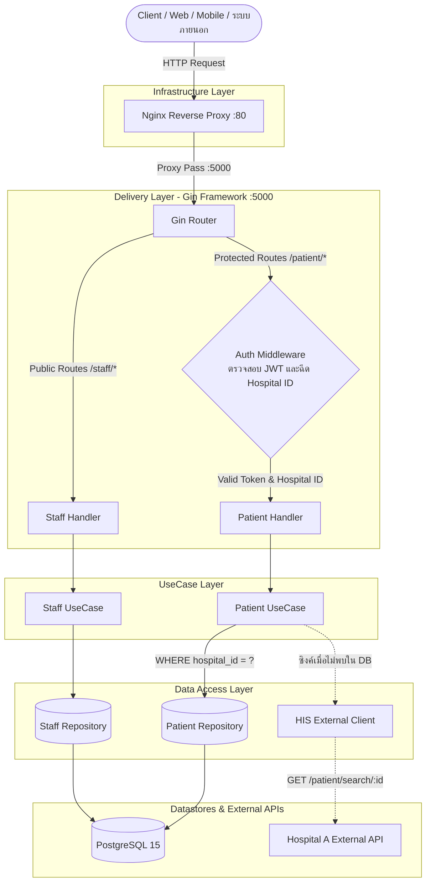
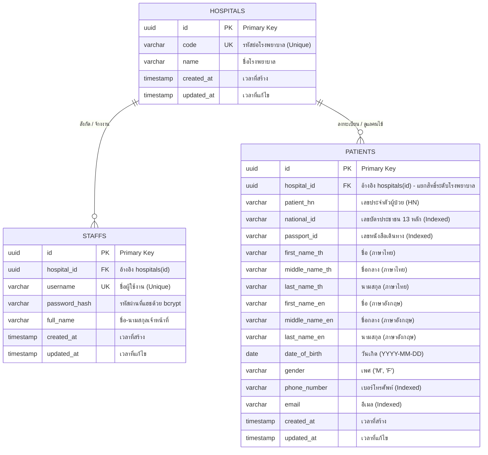

# Hospital Middleware API: เอกสารประกอบการพัฒนาและการวางแผนระบบ

> **ผู้สมัคร:** เชิดศักดิ์ (Cherdsak Kh.)  
> **ตำแหน่ง:** Back-end Developer  
> **บริษัท:** Agnos Health Co., Ltd.  
> **GitHub Repository:** [https://github.com/cherdsak-kh/hospital-middleware-api](https://github.com/cherdsak-kh/hospital-middleware-api)  
> **Swagger UI:** `http://localhost:5000/swagger/index.html`

---

## 1. ภาพรวมระบบและสถาปัตยกรรม (System Architecture)

ระบบ **Hospital Middleware API** (`hospital-middleware-api`) พัฒนาขึ้นด้วยภาษา **Go (Golang 1.27)** ร่วมกับ **Gin Web Framework** เพื่อทำหน้าที่เป็นตัวกลาง (Middleware Gateway) ในการเชื่อมต่อกับระบบสารสนเทศโรงพยาบาล (Hospital Information Systems: HIS) ช่วยให้เจ้าหน้าที่สามารถค้นหาและแสดงข้อมูลคนไข้ได้อย่างปลอดภัย พร้อมทั้งบังคับใช้การแยกสิทธิ์ข้อมูลระดับโรงพยาบาล (Hospital Data Isolation) อย่างเข้มงวด

### 1.1 รูปแบบสถาปัตยกรรม: Clean Architecture (Layered Architecture)

ระบบถูกออกแบบตามหลักการ Clean Architecture เพื่อแยกความรับผิดชอบของแต่ละส่วนอย่างชัดเจน (Separation of Concerns) ทำให้โค้ดมีความเป็นระเบียบ ง่ายต่อการดูแลรักษา และสามารถเขียน Unit Test ได้อย่างมีประสิทธิภาพ โดยแบ่งออกเป็น 4 เลเยอร์หลัก:

1. **Delivery Layer (`internal/delivery/http`):**
   * รับและจัดการ HTTP Request ผ่าน Gin Framework
   * ตรวจสอบความถูกต้องของ Input (Validation), Binding ข้อมูล, และจัดรูปแบบ Response กลับเป็น JSON มาตรฐาน
   * จัดการความปลอดภัยผ่าน Middleware (CORS, JWT Authentication, Hospital Context Injection)
2. **UseCase Layer (`internal/usecase`):**
   * บรรจุ Business Logic หลักของระบบ โดยไม่ยึดติดกับเฟรมเวิร์กภายนอก
   * ควบคุมการสมัครเจ้าหน้าที่, การตรวจสอบสิทธิ์เข้าสู่ระบบ, และการค้นหาข้อมูลคนไข้
   * ประสานงานกับ External HIS Client เมื่อต้องการค้นหาหรือซิงค์ข้อมูลจากโรงพยาบาลภายนอก
3. **Domain Layer (`internal/domain`):**
   * กำหนด Entity หลัก, Data Transfer Objects (DTOs), และ Interface กลางของระบบ
   * เป็นข้อตกลง (Contract) ร่วมกันระหว่างทุกเลเยอร์
4. **Data Access Layer (`internal/repository` และ `internal/client`):**
   * `internal/repository`: จัดการข้อมูลใน PostgreSQL ผ่าน GORM โดยบังคับเงื่อนไข SQL WHERE สำหรับ Data Isolation ทุกครั้ง
   * `internal/client`: ทำหน้าที่เป็น HTTP Client เพื่อเชื่อมต่อกับ Hospital A API (`GET https://hospital-a.api.co.th/patient/search/{id}`)

### 1.2 แผนผังการไหลของข้อมูล (Request Flow Diagram)



---

## 2. โครงสร้างโฟลเดอร์โปรเจกต์ (Deliverable 1a: Project Structure)

```text
hospital-middleware-api/
├── cmd/
│   └── server/
│       └── main.go                  # จุดเริ่มต้นของแอปพลิเคชันและการทำ Dependency Injection
├── config/
│   └── config.go                    # โหลดค่า Environment Variables (.env และ System Environment)
├── internal/
│   ├── domain/                      # Domain Entities, DTOs และ Interfaces
│   │   ├── hospital.go              # โมเดลและสัญญา Interface ของ Hospital
│   │   ├── staff.go                 # โมเดล Staff, DTOs สำหรับ Create และ Login
│   │   └── patient.go               # โมเดล Patient, DTOs สำหรับ Search Query และ External HIS
│   ├── repository/                  # เลเยอร์ติดต่อฐานข้อมูล (PostgreSQL / GORM)
│   │   ├── db.go                    # เริ่มต้นการเชื่อมต่อฐานข้อมูลและการทำ AutoMigrate
│   │   ├── hospital_repository.go   # ฟังก์ชันจัดการข้อมูลโรงพยาบาล
│   │   ├── staff_repository.go      # ฟังก์ชันจัดการข้อมูลเจ้าหน้าที่
│   │   └── patient_repository.go    # ค้นหาคนไข้แบบ Dynamic Query ที่บังคับ hospital_id เสมอ
│   ├── usecase/                     # เลเยอร์ Business Logic
│   │   ├── staff_usecase.go         # แฮชรหัสผ่านด้วย bcrypt และการออก JWT Token
│   │   ├── staff_usecase_test.go    # Unit Tests สำหรับระบบ Staff
│   │   ├── patient_usecase.go       # ค้นหาคนไข้และการเชื่อมต่อ External HIS
│   │   └── patient_usecase_test.go  # Unit Tests สำหรับ Data Isolation และการซิงค์ HIS
│   ├── delivery/
│   │   └── http/                    # เลเยอร์ HTTP Transport (Gin Framework)
│   │       ├── middleware/
│   │       │   ├── auth_middleware.go      # ตรวจสอบ JWT Bearer และฉีด hospital_id เข้าสู่ Context
│   │       │   └── auth_middleware_test.go # Unit Tests สำหรับ Auth Middleware
│   │       ├── staff_handler.go            # Handler สำหรับ /staff/create และ /staff/login
│   │       ├── patient_handler.go          # Handler สำหรับ /patient/search (รองรับทั้ง GET และ POST)
│   │       └── router.go                   # ตั้งค่า Routes, CORS, Health Check, และ Swagger UI
│   └── client/
│       └── his_client.go            # HTTP Client สำหรับเชื่อมต่อ Hospital A External API
├── pkg/
│   ├── utils/                       # ฟังก์ชัน Helper ส่วนกลาง
│   │   ├── password.go              # ฟังก์ชันแฮชและตรวจสอบรหัสผ่านด้วย bcrypt
│   │   ├── password_test.go         # Unit Tests สำหรับฟังก์ชัน Password
│   │   ├── jwt.go                   # ฟังก์ชันสร้างและตรวจสอบ JWT Token
│   │   └── jwt_test.go              # Unit Tests สำหรับฟังก์ชัน JWT
│   └── response/
│       └── response.go              # โครงสร้าง JSON Response มาตรฐาน
├── docs/                            # เอกสารประกอบการพัฒนา
│   ├── deliverables_en.md           # เอกสารฉบับภาษาอังกฤษ (สำหรับส่งตรวจ)
│   ├── deliverables_th.md           # เอกสารฉบับภาษาไทย
│   ├── architecture_and_schema.md   # รายละเอียดสถาปัตยกรรมและ Schema
│   ├── docs.go                      # ไฟล์ Go สำหรับ Swagger
│   ├── swagger.json                 # OpenAPI Specification ในรูปแบบ JSON
│   └── swagger.yaml                 # OpenAPI Specification ในรูปแบบ YAML
├── migrations/
│   └── 000001_init_schema.up.sql    # สคริปต์ SQL DDL สร้างตารางและ Composite Indexes
├── nginx/                           # การตั้งค่า Nginx Reverse Proxy
│   ├── nginx.conf                   # การตั้งค่า Nginx หลัก
│   └── conf.d/default.conf          # กำหนด Reverse Proxy ส่งต่อ Request ไปยัง Go App
├── Dockerfile                       # Multi-stage Docker Build (Alpine Runtime)
├── docker-compose.yml               # กำหนด Services: db (PostgreSQL 15), app, nginx
├── .env.example                     # ตัวอย่างการตั้งค่า Environment Variables
├── .gitignore                       # รายการไฟล์ที่ไม่รวมเข้าใน Git
└── README.md                        # เอกสารแนะนำการติดตั้งและคู่มือการรันระบบ
```

---

## 3. การออกแบบฐานข้อมูลและ ER Diagram (Deliverable 1c: ER Diagram)

### 3.1 แผนภาพความสัมพันธ์ของเอนทิตี (ER Diagram)



### 3.2 กลยุทธ์การสร้าง Composite Indexes เพื่อประสิทธิภาพการค้นหา

เนื่องจาก API ค้นหาคนไข้ (`/patient/search`) ทุกฟิลด์เป็นทางเลือก (Optional) การสร้าง Index แบบเดี่ยวอาจทำให้ระบบทำงานช้าลง เราจึงสร้าง **Composite Indexes ที่ขึ้นต้นด้วย `hospital_id` เสมอ** เพื่อให้ PostgreSQL กรองระดับโรงพยาบาลได้เร็วที่สุด:

1. `idx_patients_hospital_national_id ON patients(hospital_id, national_id)`
2. `idx_patients_hospital_passport_id ON patients(hospital_id, passport_id)`
3. `idx_patients_hospital_phone ON patients(hospital_id, phone_number)`
4. `idx_patients_hospital_email ON patients(hospital_id, email)`
5. `idx_patients_hospital_name_th ON patients(hospital_id, first_name_th, last_name_th)`
6. `idx_patients_hospital_name_en ON patients(hospital_id, first_name_en, last_name_en)`

---

## 4. กลไกการแยกสิทธิ์ข้อมูลระดับโรงพยาบาล (Hospital Data Isolation)

ข้อกำหนดสำคัญที่สุดของโจทย์คือ: **เจ้าหน้าที่แต่ละคนสามารถค้นหาได้เฉพาะข้อมูลคนไข้ในโรงพยาบาลเดียวกันกับตนเองเท่านั้น**

ระบบบังคับใช้ความปลอดภัยผ่าน **สถาปัตยกรรมป้องกัน 3 ชั้น (3-Tier Defense-in-Depth)**:

1. **ชั้นที่ 1 (Signed JWT Claims):**
   * เมื่อเจ้าหน้าที่ล็อกอินสำเร็จ (`/staff/login`) ระบบจะสร้าง JWT Token ที่เซ็นชื่อแบบเข้ารหัส HMAC-SHA256
   * Token Payload จะบรรจุ `hospital_id`, `staff_id`, และ `username`
   * ผู้ใช้ภายนอกไม่สามารถแก้ไขค่า `hospital_id` ได้ เพราะจะทำให้ลายเซ็น Token เสียทันที
2. **ชั้นที่ 2 (Context Injection จากเซิร์ฟเวอร์):**
   * `AuthMiddleware` ตรวจสอบความถูกต้องของ Token ก่อนส่งต่อ Request
   * สกัดค่า `hospital_id` ที่เชื่อถือได้จาก Token Claims แล้วฝังลงใน Gin Context (`c.Set("hospital_id", claims.HospitalID)`)
   * Client ไม่สามารถส่งค่า `hospital_id` มาทาง Query String เพื่อหลอกระบบได้
3. **ชั้นที่ 3 (บังคับเงื่อนไขในระดับ SQL Query):**
   * ใน `internal/repository/patient_repository.go` ทุกคำสั่งค้นหาถูกล็อคเงื่อนไขอย่างเด็ดขาด:
     ```sql
     SELECT * FROM patients WHERE hospital_id = :authenticated_hospital_id AND (...เงื่อนไขการค้นหา...);
     ```
   * **ผลลัพธ์:** หาก Staff ของ Hospital A ค้นหาข้อมูลคนไข้ที่มีอยู่ใน Hospital B ระบบจะส่งคืนผลลัพธ์เป็น Array ว่าง (`[]`) เสมอ ป้องกันการรั่วไหลของข้อมูลคนไข้ข้ามโรงพยาบาลได้ 100%

---

## 5. ข้อมูลจำเพาะของ API (Deliverable 1b: API Specifications)

ทุก Endpoint ตอบกลับด้วยโครงสร้าง JSON มาตรฐาน:
```json
{
  "success": true,
  "message": "คำอธิบายผลลัพธ์",
  "data": {},
  "error": null
}
```

### 5.1 Interactive Swagger UI
* **URL:** `http://localhost:5000/swagger/index.html` (ตรง) หรือ `http://localhost/swagger/index.html` (ผ่าน Nginx)
* รองรับการทดสอบจริงผ่าน Browser พร้อมระบบ Bearer Token Authorization

---

### 5.2 Root Endpoint (`GET /`)
* **Endpoint:** `GET /`
* **Response (200 OK):**
  ```json
  {
    "service": "hospital-middleware-api",
    "status": "running"
  }
  ```

---

### 5.3 Health Check (`GET /health`)
* **Endpoint:** `GET /health`
* **Response (200 OK):**
  ```json
  {
    "service": "hospital-middleware-api",
    "status": "ok",
    "uptime": "12m34s"
  }
  ```

---

### 5.4 สร้างบัญชีเจ้าหน้าที่ (`POST /staff/create`)
* **Endpoint:** `POST /staff/create`
* **Content-Type:** `application/json`
* **Request Body:**
  ```json
  {
    "username": "nurse_somying",
    "password": "Password123!",
    "hospital": "Hospital A",
    "full_name": "Somying Raksa"
  }
  ```
* **Success Response (201 Created):**
  ```json
  {
    "success": true,
    "message": "Staff account created successfully",
    "data": {
      "id": "c1f7a08b-1234-4567-89ab-cdef01234567",
      "username": "nurse_somying",
      "hospital_id": "9b1deb4d-5678-4321-8765-abcdefabcdef",
      "full_name": "Somying Raksa",
      "created_at": "2026-09-15T08:00:00Z"
    }
  }
  ```
* **Error Responses:**
  * `400 Bad Request`: ข้อมูลไม่ครบถ้วน หรือรูปแบบไม่ถูกต้อง
  * `409 Conflict`: ชื่อผู้ใช้งาน (Username) มีอยู่ในระบบแล้ว

---

### 5.5 เจ้าหน้าที่เข้าสู่ระบบ (`POST /staff/login`)
* **Endpoint:** `POST /staff/login`
* **Content-Type:** `application/json`
* **Request Body:**
  ```json
  {
    "username": "nurse_somying",
    "password": "Password123!",
    "hospital": "Hospital A"
  }
  ```
* **Success Response (200 OK):**
  ```json
  {
    "success": true,
    "message": "Authentication successful",
    "data": {
      "token": "eyJhbGciOiJIUzI1NiIsInR5cCI6IkpXVCJ9...",
      "token_type": "Bearer",
      "expires_in": 86400,
      "staff": {
        "id": "c1f7a08b-1234-4567-89ab-cdef01234567",
        "username": "nurse_somying",
        "hospital_id": "9b1deb4d-5678-4321-8765-abcdefabcdef",
        "full_name": "Somying Raksa"
      }
    }
  }
  ```
* **Error Responses:**
  * `401 Unauthorized`: ชื่อผู้ใช้, รหัสผ่าน, หรือโรงพยาบาลไม่ถูกต้อง

---

### 5.6 ค้นหาข้อมูลคนไข้ (`GET /patient/search` และ `POST /patient/search`)
* **Endpoint:** `GET /patient/search` หรือ `POST /patient/search`
* **Authentication:** ต้องแนบ `Authorization: Bearer <token>`
* **Parameters (ทุกฟิลด์เป็นทางเลือก - Optional):**
  * `national_id` (string): เลขบัตรประจำตัวประชาชน
  * `passport_id` (string): เลขหนังสือเดินทาง
  * `first_name` (string): ชื่อ (ค้นหาได้ทั้งภาษาไทยและอังกฤษ)
  * `middle_name` (string): ชื่อกลาง
  * `last_name` (string): นามสกุล
  * `date_of_birth` (string): วันเกิดในรูปแบบ YYYY-MM-DD
  * `phone_number` (string): หมายเลขโทรศัพท์
  * `email` (string): ที่อยู่อีเมล
* **Success Response (200 OK):**
  ```json
  {
    "success": true,
    "message": "Patients retrieved successfully",
    "data": [
      {
        "id": "e4d3c2b1-0000-0000-0000-111122223333",
        "hospital_id": "9b1deb4d-5678-4321-8765-abcdefabcdef",
        "patient_hn": "HN1001",
        "national_id": "1100100100101",
        "passport_id": "AA1234567",
        "first_name_th": "สมชาย",
        "middle_name_th": "",
        "last_name_th": "ใจดี",
        "first_name_en": "Somchai",
        "middle_name_en": "",
        "last_name_en": "Jaidee",
        "date_of_birth": "1990-01-15T00:00:00Z",
        "gender": "M",
        "phone_number": "0812345678",
        "email": "somchai.j@example.com",
        "created_at": "2026-09-15T08:00:00Z",
        "updated_at": "2026-09-15T08:00:00Z"
      }
    ]
  }
  ```
* **Error Responses:**
  * `401 Unauthorized`: ไม่ได้ส่ง Token, Token หมดอายุ, หรือ Token ไม่ถูกต้อง

---

## 6. การทดสอบและการรับประกันคุณภาพ (Task 5: Unit Tests)

ชุดทดสอบของระบบถูกเขียนขึ้นเพื่อครอบคลุมทั้ง Positive และ Negative Scenarios โดยใช้ Mock ทำให้รันได้รวดเร็วโดยไม่ต้องพึ่งพาฐานข้อมูลภายนอก:

```bash
go test -v ./...
```

* **ผลการทดสอบ Unit Tests:**
  * `pkg/utils/password_test.go`: **PASS** (ทดสอบแฮชรหัสผ่านและการปฏิเสธรหัสผ่านผิด)
  * `pkg/utils/jwt_test.go`: **PASS** (ทดสอบการสร้าง Token และการตรวจสอบ Claims)
  * `internal/delivery/http/middleware/auth_middleware_test.go`: **PASS** (ทดสอบกรณีไม่มี Token, Token ผิดรูปแบบ, และดึง hospital_id ถูกต้อง)
  * `internal/usecase/staff_usecase_test.go`: **PASS** (ทดสอบสร้าง Staff, Login, และปฏิเสธ Username ซ้ำ)
  * `internal/usecase/patient_usecase_test.go`: **PASS** (ทดสอบค้นหาคนไข้ในโรงพยาบาล, **พิสูจน์การบล็อกข้อมูลข้ามโรงพยาบาล**, และการซิงค์ข้อมูลจาก Hospital A)
* **ผลสรุป:** ทุกชุดการทดสอบผ่าน 100%

---

## 7. การติดตั้งและรันด้วย Docker Compose (Deliverable 2)

ระบบถูกจัดเตรียมเป็น Containers พร้อมใช้งาน 3 ตัว:
1. **`db`:** PostgreSQL 15 กำหนดแมปพอร์ตโฮสต์เป็น `5435` (เพื่อไม่ให้ชนกับฐานข้อมูลเดิมของเครื่อง) พร้อมสร้างตารางอัตโนมัติและเก็บข้อมูลแบบ Persistent
2. **`hospital-middleware-api`:** Go Binary ที่คอมไพล์ผ่าน Multi-stage Dockerfile รันบนพอร์ต `5000`
3. **`nginx`:** Reverse Proxy พอร์ต `80` จัดการ Routing ส่งต่อไปยัง Go App

### คำสั่งเริ่มระบบในคำสั่งเดียว:
```bash
docker compose up --build -d
```
ระบบทุกตัวจะสตาร์ทขึ้นมาและพร้อมทำงานร่วมกันได้ทันที
